<br>

# ⛅️ Skycast
Skycast is an iOS weather forecast app using **Combine** & **SwiftUI**. The project was developed as my graduation project from [Robusta Studio](https://robustagroup.com) internship program in 2023. For a deeper understanding of the project's requirements and functionalities, check out the requirements file [here](Requirements.md).

<br>

## ▶️ Demo
Watch the demo video on [YouTube]().

<br>

## 🌟 Features
- Display weather information based on your current location
- Search for a city to display weather information for
- Searched cities are save locally on your device
- Display weather temperature, conditions, and information
- Display weather information for the upcoming days
- Update application temperature degree preferences (Celsius/Fahrenheit)
- Update application color scheme preferences (Light/Dark Mode)
- Set a daily reminder to check today's weather
- Application supports Arabic/English localization

<br>

## 🖼️ Screenshots

### ☀️ Light Mode
| **Today Forecast** | **Daily Forecast** | **Add City** | **Settings** |
| ------------------ | ------------------ | ------------ | ------------ |
| 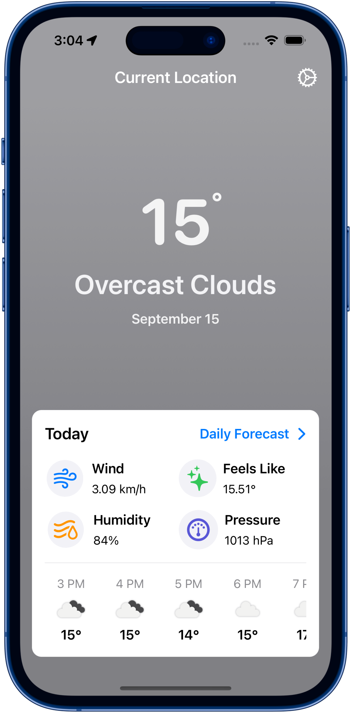 | 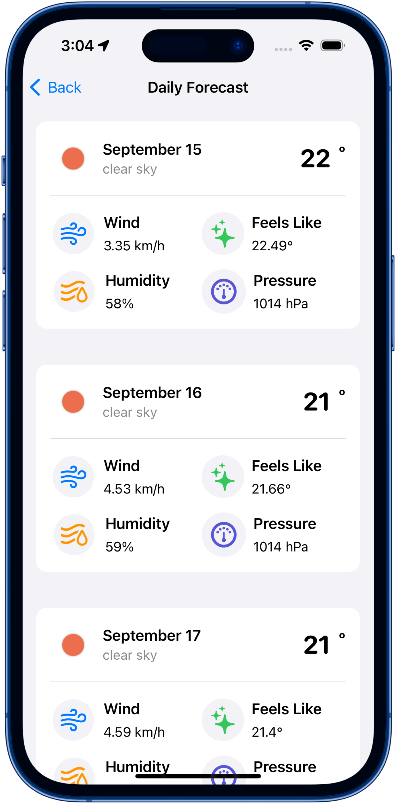 | 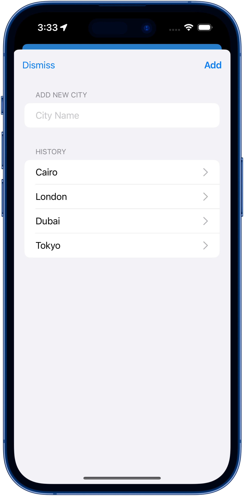 | 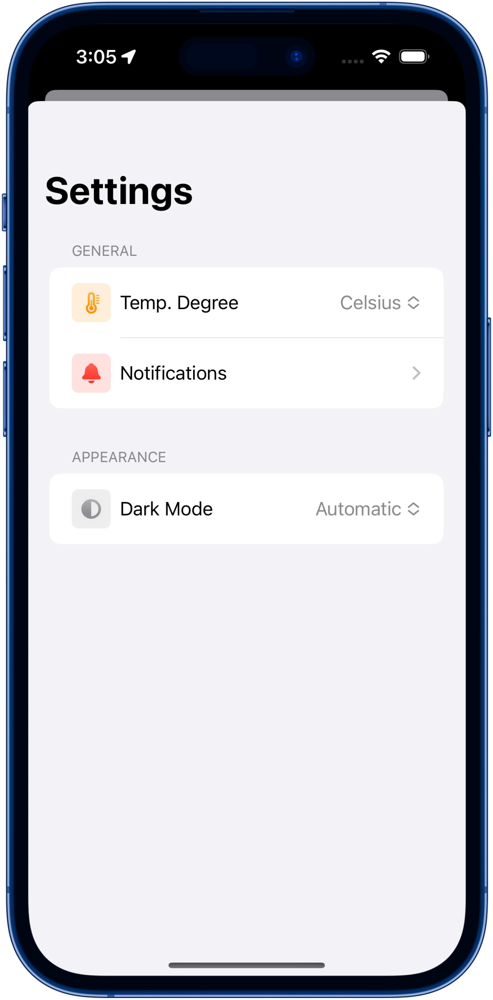 |

### 🌙 Dark Mode
| **Today Forecast** | **Daily Forecast** | **Add City** | **Settings** |
| ------------------ | ------------------ | ------------ | ------------ |
| 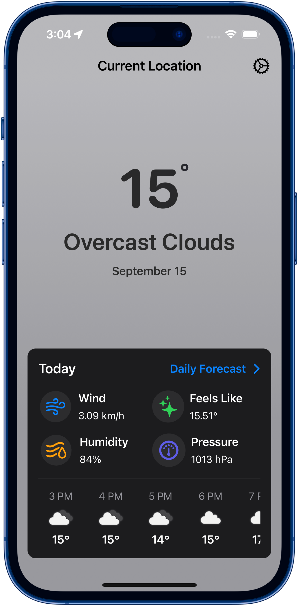 | 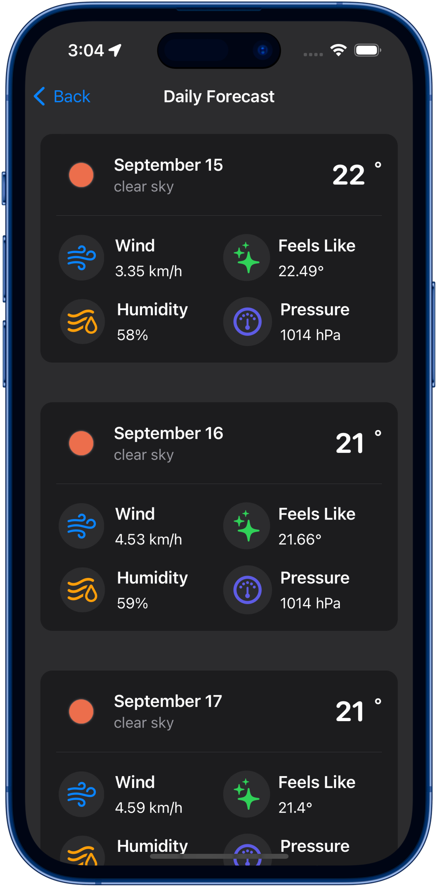 | 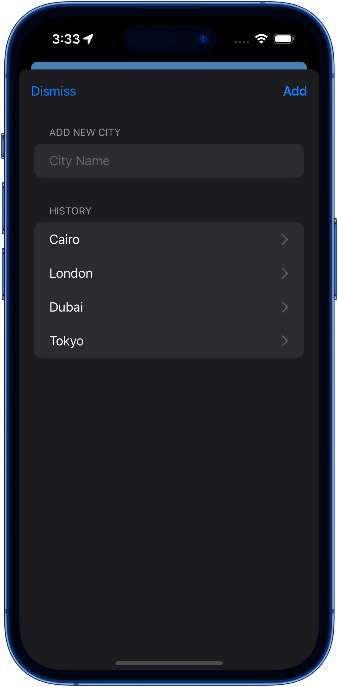 | 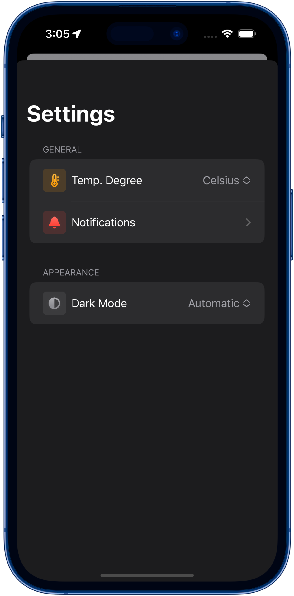 |

### 🌍 Localization
| **Settings** | **Add City** | **Daily Forecast** | **Today Forecast** |
| ------------ | ------------ | ------------------ | ------------------ |
| 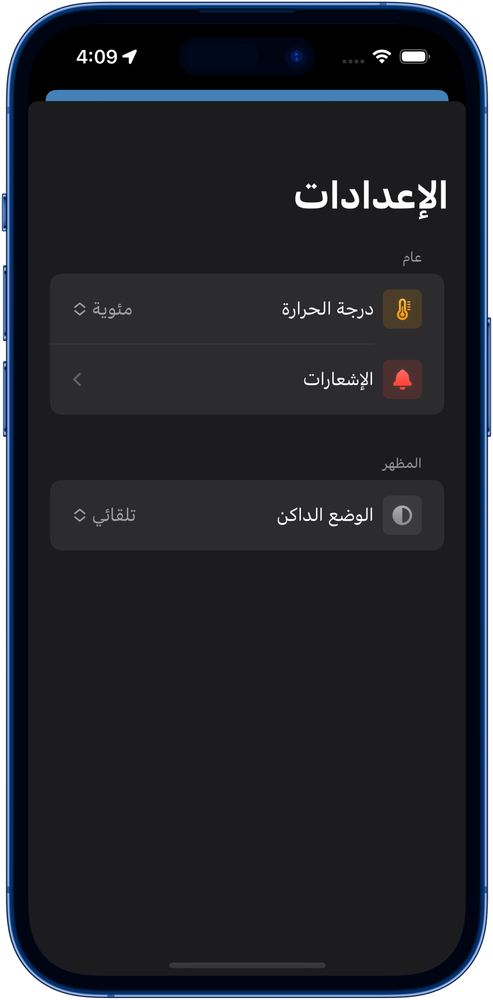 | 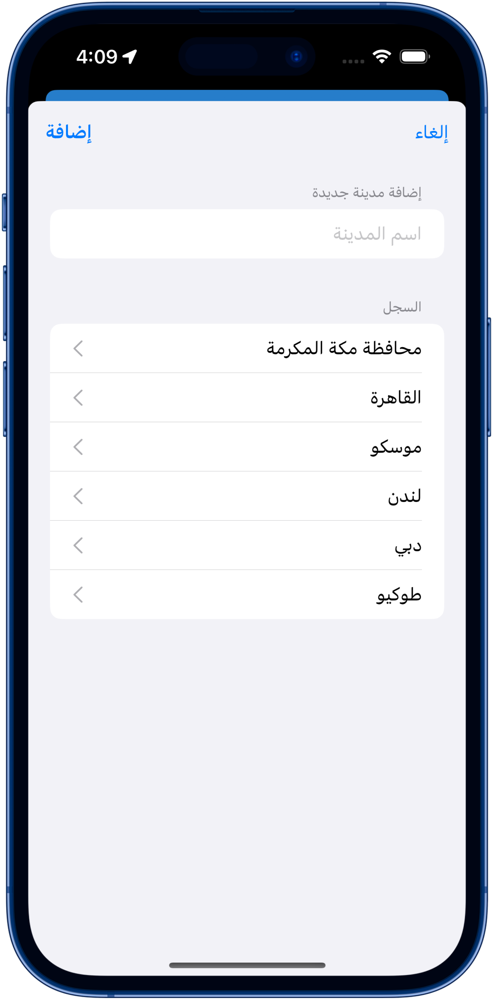 | 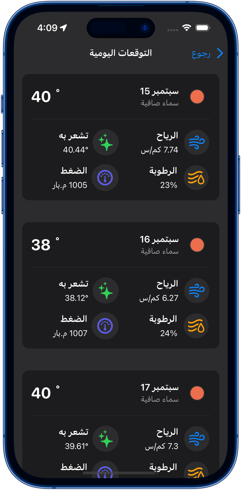 | 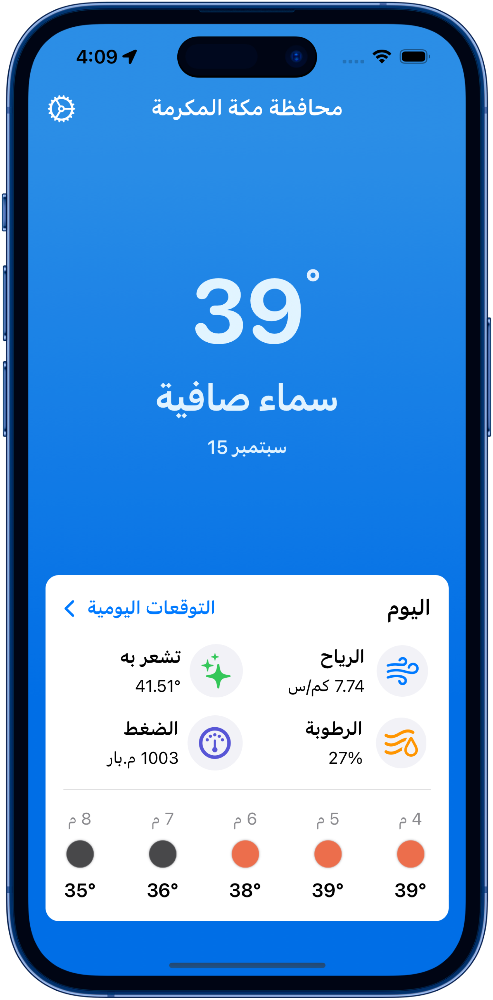 |

### 🌡️ Weather Conditions
| **Clear** | **Rain** | **Clouds** |
| --------- | -------- | ---------- |
| 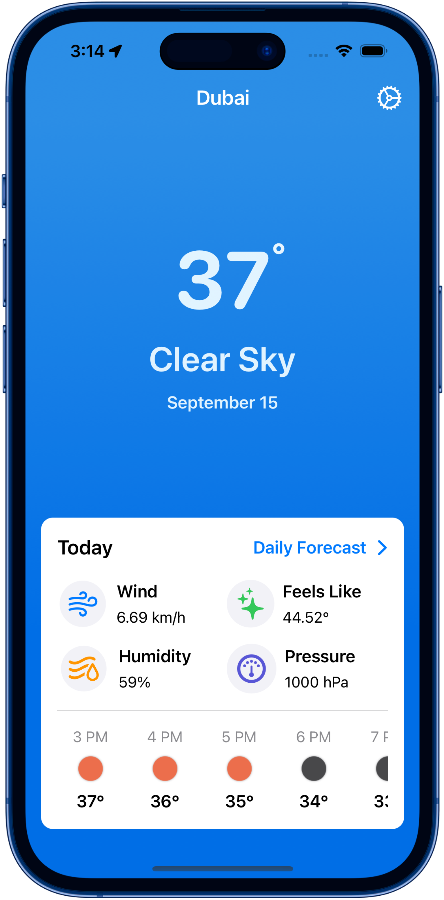 | 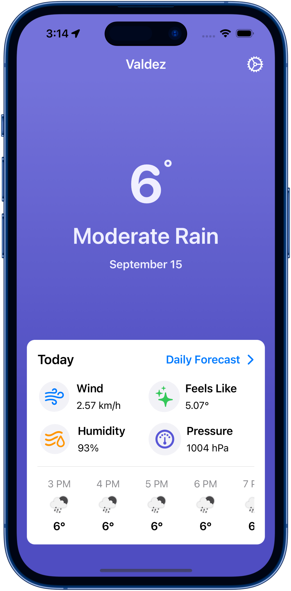 | 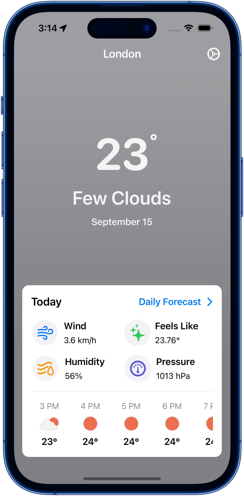 |

### 🔁 Landscape Mode
| **English** | **Arabic** |
| ----------- | ---------- |
| 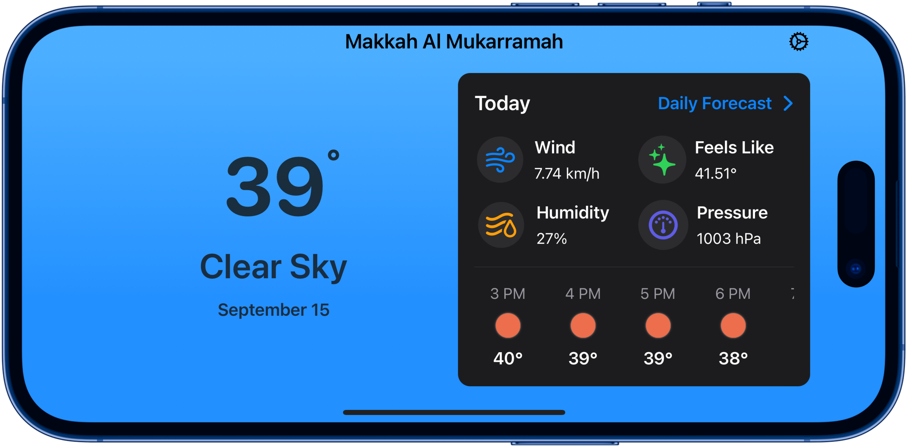 | 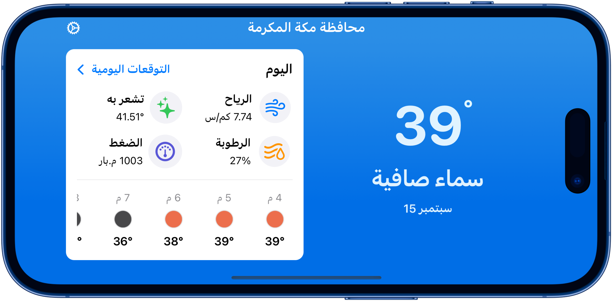 |

<br>

## ☁️ API
This project uses the [OpenWeather](https://openweathermap.org) One Call API 3.0.

<br>

## 🛠️ Tools
- Swift
- SwiftUI
- Combine
- UserDefaults
- Local Notification
- Localization
- Network
- Core Location

<br>

## 🏗️ Architecture
This app uses MVVM (Model - View - View Model) architectural pattern.

<br>

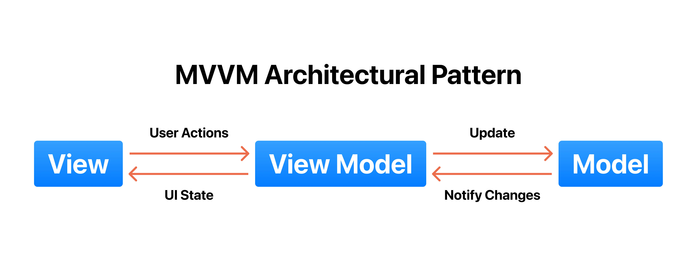

<br>

## 🗂️ Project Structure

```
    Skycast                          # Root Group
    .
    ├── Presentation                 # Organizing views and view-related components
    |   ├── Shared Components        # Components that used by multiple views
    |   └── Scenes                   # All interface screens
    |       └── Scene                # A scene that represents single screen/feature
    |           ├── Components       # Related components for a scene
    |           ├── Views            # SwiftUI Views for a scene
    |           └── View Models      # View Models for a SwiftUI view
    ├── Models                       # Data models and entities
    ├── Managers                     # Managers for data, network requests, or other complex operations
    ├── Services                     # API services for fetching data
    ├── Extensions                   # Useful extensions for presentation
    ├── Utilities                    # Utilities for fetching data and presentation layout
    ├── Globals                      # App constants
    └── Localizable                  # localization strings
```

<br>

## ⚖️ License
```
    MIT License
    
    Copyright (c) 2023 Baher Tamer
    
    Permission is hereby granted, free of charge, to any person obtaining a copy
    of this software and associated documentation files (the "Software"), to deal
    in the Software without restriction, including without limitation the rights
    to use, copy, modify, merge, publish, distribute, sublicense, and/or sell
    copies of the Software, and to permit persons to whom the Software is
    furnished to do so, subject to the following conditions:
    
    The above copyright notice and this permission notice shall be included in all
    copies or substantial portions of the Software.
    
    THE SOFTWARE IS PROVIDED "AS IS", WITHOUT WARRANTY OF ANY KIND, EXPRESS OR
    IMPLIED, INCLUDING BUT NOT LIMITED TO THE WARRANTIES OF MERCHANTABILITY,
    FITNESS FOR A PARTICULAR PURPOSE AND NONINFRINGEMENT. IN NO EVENT SHALL THE
    AUTHORS OR COPYRIGHT HOLDERS BE LIABLE FOR ANY CLAIM, DAMAGES OR OTHER
    LIABILITY, WHETHER IN AN ACTION OF CONTRACT, TORT OR OTHERWISE, ARISING FROM,
    OUT OF OR IN CONNECTION WITH THE SOFTWARE OR THE USE OR OTHER DEALINGS IN THE
    SOFTWARE.
```
